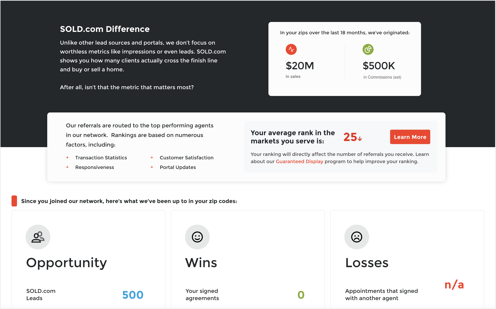
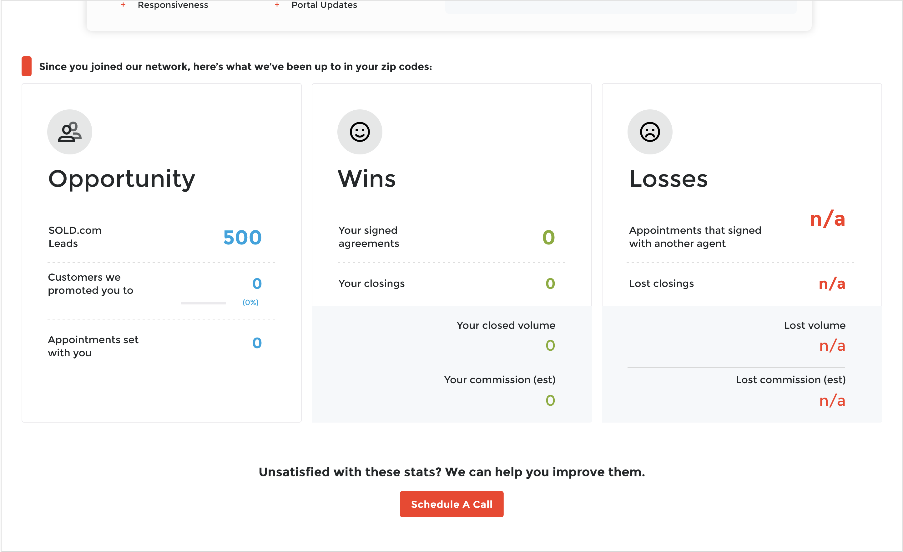

## Getting Started

This version of Next.js requires node 14.

First, run the development server:

```bash
npm run dev
```

Open [http://localhost:3000](http://localhost:3000) with your browser to see the result.

You can start editing the page by modifying `pages/index.tsx`. The page auto-updates as you edit the file.

[API routes](https://nextjs.org/docs/api-routes/introduction) can be accessed on [http://localhost:3000/api/hello](http://localhost:3000/api/hello). This endpoint can be edited in `pages/api/hello.ts`.

The `pages/api` directory is mapped to `/api/*`. Files in this directory are treated as [API routes](https://nextjs.org/docs/api-routes/introduction) instead of React pages.

This project uses [`next/font`](https://nextjs.org/docs/basic-features/font-optimization) to automatically optimize and load Inter, a custom Google Font.

### Tailwind

This project also utilizes [Tailwind CSS](https://tailwindcss.com).

Please style your components using Tailwind classes ONLY.

**DO NOT create custom CSS classes unless absolutely necessary.**

I would recommend reading their docs and installing their editor plugin for editor hinting.

https://tailwindcss.com/docs/editor-setup

## Requirements

You are to re-create a new dashboard page using **ONLY NextJS, React, & Tailwind**.

I should be able to access this page from http://localhost:3000/dashboard.

Do not worry about re-creating the header or the footer.

Only these sections:




Design must also be **MOBILE FRIENDLY!**

Full design and assets [here](https://xd.adobe.com/view/de34b3ec-0563-421d-bdf5-122777b136b5-8b67/screen/3e7e6e6d-66a3-4dc0-9184-7580a44d5286/)

Upon completion, please share the github link to the cloned/forked project.

## Learn More

To learn more about Next.js, take a look at the following resources:

- [Next.js Documentation](https://nextjs.org/docs) - learn about Next.js features and API.
- [Learn Next.js](https://nextjs.org/learn) - an interactive Next.js tutorial.

You can check out [the Next.js GitHub repository](https://github.com/vercel/next.js/) - your feedback and contributions are welcome!

## Questions

If you have any questions about anything, please reach out to the person or team that administered this test to you.

Other than that, happy coding!# Nextjs-Jr-test
